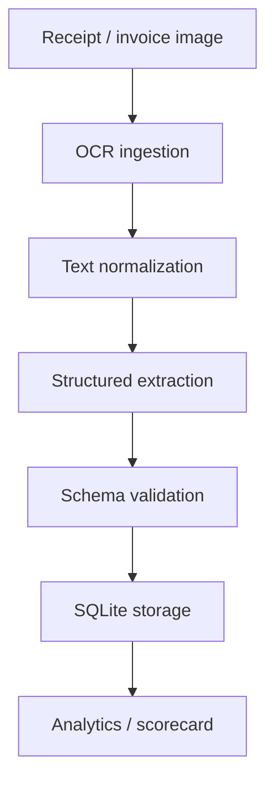

# DocuStruct

DocuStruct is an offline-first, CPU-optimized document pipeline that turns receipt and invoice images into structured, queryable data. It is built for the Local AI hackathon brief: no external APIs, no cloud dependencies, and fully local inference and storage.

## What It Does

DocuStruct processes a receipt image through four stages:

1. OCR ingestion with preprocessing, retry, soft timeout, and on-disk cache.
2. Structured extraction into the shared schema defined in `schema.py`.
3. Validation of required fields and arithmetic consistency.
4. SQLite persistence for browsing and analytics.

## Architecture



## Current Status

The following is implemented and working end to end:

- Offline OCR to structured output pipeline.
- Streamlit UI with upload, camera capture, database explorer, and analytics.
- Shared CLI and UI pipeline logic.
- OCR cache versioning to avoid stale results.
- Rule-based extraction with support for messy receipt formats.
- Optional local `llama-cpp-python` extractor for a GGUF model.
- Repeatable scoring for bundled sample receipts.
- Tests for OCR cache behavior, extraction, storage, evaluation, and pipeline flow.

## What to Upload

For the best demo and for real scoring, start with the bundled sample images:

- `samples/receipt_cafe.png`
- `samples/receipt_grocery.png`
- `samples/receipt_hardware.png`

You can also upload real receipt or invoice images in `PNG`, `JPG`, `JPEG`, or `WEBP` format. Full-frame, well-lit photos work best.

## Setup

```bash
cd /path/to/docustruct
python3 -m venv .venv
source .venv/bin/activate
pip install -r requirements.txt
```

## Run

CLI demo:

```bash
python app.py samples/*.png --report
```

Streamlit UI:

```bash
streamlit run streamlit_app.py
```

If you want the compatibility entrypoint used by older commands, `streamlit.py` forwards to the same app.

## Evaluation and Metrics

The analytics page and CLI report surface real numbers from the sample set:

- Field accuracy
- Line-item accuracy
- Validation pass rate
- Offline success rate
- Latency
- Peak memory
- Overall score

These numbers are grounded in the bundled sample receipts, which have known expected outputs.

## Local Model Support

DocuStruct includes a local SLM integration path through `llama-cpp-python`. To use it, point the extractor at a local `.gguf` file:

```python
from extract.extractor import LocalLLMExtractor
extractor = LocalLLMExtractor(model_path="./models/model.gguf")
```

This keeps the rest of the pipeline unchanged.

## Future Scope

Planned next steps for the project:

- Add PDF ingestion in addition to images.
- Improve OCR handling for heavily skewed or low-light receipts.
- Add more robust line-item parsing for retail receipts with complex layouts.
- Support multilingual OCR and extraction.
- Extend the scoring harness with larger labeled benchmark sets.
- Add export formats such as CSV and JSONL.
- Add a review workflow for low-confidence extractions.
- Expand the local model path with better prompt templates and structured decoding.

## Repository Layout

```text
docustruct/
├── app.py
├── evaluation.py
├── extract/
├── ingest/
├── pipeline.py
├── schema.py
├── storage/
├── streamlit_app.py
├── streamlit.py
├── tests/
└── samples/
```